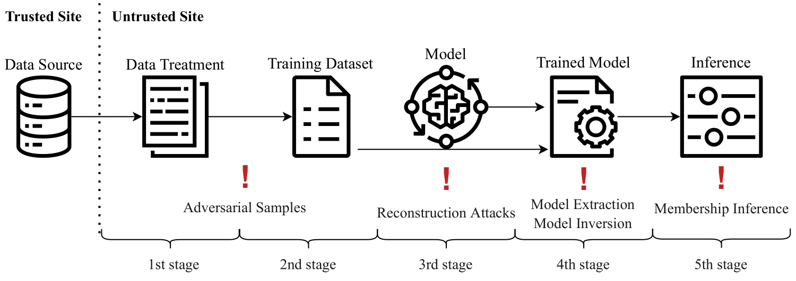
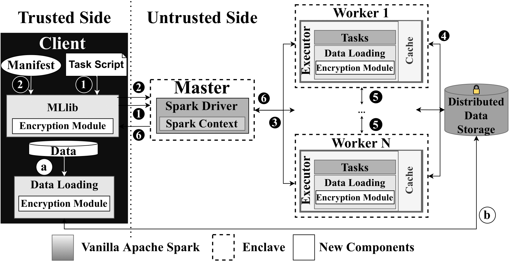
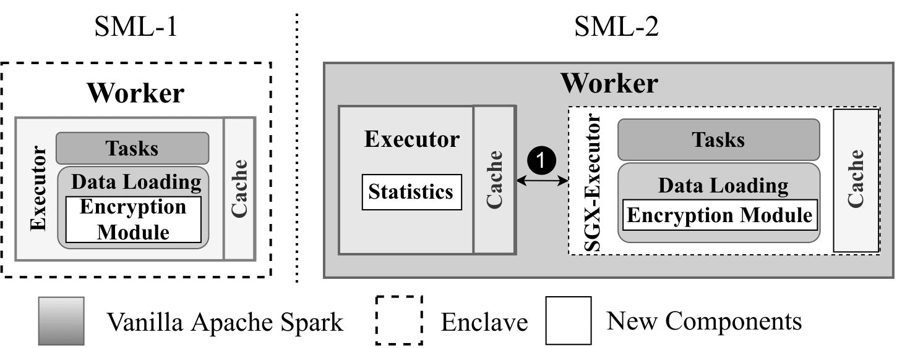

# SOTERIA: Privacy-Preserving Machine Learning for Apache Spark

**SOTERIA** is a privacy-preserving machine learning solution developed on top of [Apache Spark](https://github.com/apache/spark) and resorting to [Graphene-SGX](https://github.com/oscarlab/graphene) (currently named [Gramine](https://github.com/gramineproject/gramine)).
Built upon the concept of computation partitioning, SOTERIA allows running machine learning workloads inside the enclaves while running non-sensitive code outside. 
The main goal of SOTERIA, besides providing alternatives for state-of-the-art solutions is to improve the security of running these workloads in the real world. 

**Warning 1**: This is an academic proof-of-concept prototype and has not received careful code review. This implementation is NOT ready for production use.

**Warning 2**: This is repository is being updated accordingly to the last submission.

<!--
___
## Overview

### Machine Learning and Attacks
SOTERIA was built based on the current attacks to the machine learning pipeline as seen in the figure below. 
Specifically, we will consider Adversarial Attacks, Model Extraction, Model Inversion and Membership Inference, and Reconstruction Attacks. 

<p align="center">
    
</p>

### Architecture

As depicted in Figure 2 by the gray boxes, a Spark cluster is composed of a Master and several Worker nodes.
The architecture of SOTERIA consists of two main designs, SML-1 and SML-2. 

<p align="center">
    
</p>

SML-1 intends to run all the workloads inside the enclaves, with both master and worker nodes running inside the enclaves.

SML-2 resorts to the partitioning of computation between what runs inside the enclaves and outside the enclaves. With this, a single worker node becomes a double worker node, i.e., two workers run on the node, with one running inside the enclaves and the other outside the enclave. This mechanism reduces the amount of trusted code base to be run inside the enclaves which intends to reduce the overhead imposed by large amounts of code running inside SGX.

<p align="center">
    
</p>

### Security Proofs

In [`proofs`](https://github.com/claudiavmbrito/Soteria/tree/main/proofs), you can find the security proofs of SOTERIA. We discuss the security protocol followed by SOTERIA and define it formally. 

It is divided into two main sections: Section A present the full proof of SOTERIA for all components and Section B depicts the ML attacks and in which circumstances SOTERIA is secure against each attack. 

### Full paper
 
**SOTERIA** was accepted for publication on SAC23. 
Full citation will be available later on.

For more information please see: 
https://eprint.iacr.org/2021/966.pdf (will be updated soon)

If you need to cite our work:
```
@misc{cryptoeprint:2021/966,
      author = {Cláudia Brito and Pedro Ferreira and Bernardo Portela and Rui Oliveira and João Paulo},
      title = {Soteria: Privacy-Preserving Machine Learning for Apache Spark},
      howpublished = {Cryptology ePrint Archive, Paper 2021/966},
      year = {2021},
      note = {\url{https://eprint.iacr.org/2021/966}},
      url = {https://eprint.iacr.org/2021/966}
}
```
___

## Getting Started

The code for "SOTERIA: Privacy-Preserving Machine Learning for Apache Spark" will be fully published here soon.

### Dependencies

SOTERIA is mainly written in Scala, JAVA and C and was built and tested with Intel's SGX SDK `2.6`, SGX Driver `1.8` and Gramine `1.0` (previously named Graphene-SGX).

### Apache Spark

To install Apache Spark to test the vanilla version, please run and see `build.sh` in [`scripts`](https://github.com/claudiavmbrito/Soteria/tree/main/scripts).

#### Data Encryption

For easy to use encryption, we implement an encryption mechanism based on AES-GCM 128. Such file is implemented inside of Apache Spark allowing its broad use outside of SOTERIA.


### Intel SGX

To install SGX SDK and its Driver, please see `install_sgx.sh` and run:
```
bash ./install_sgx.sh
```

### Gramine 

- To use the previous and base code of Gramine used to develop SOTERIA, please refer to https://github.com/gramineproject/gramine/tree/v1.0.
- To use the updated version of Gramine, follow [Gramine](https://github.com/gramineproject/gramine) documentation. 
---

### Cluster in Cloudera 

To install Cloudera version for which SOTERIA was tested, please see `install_cluster.sh` and run:
```
bash ./install_cluster.sh
```

Then, change the Manifest accordingly.

___
-->

## Contact

Please contact us at `claudia.v.brito@inesctec.pt` with any questions.
